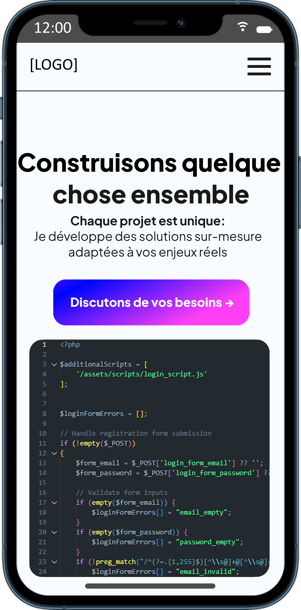

# Produit: Moi (Maxime Cordonnier)

## Démarrage et cadrage

Le produit que j'ai choisie de vendre c'est moi (de cette manière je peut avoir une première approche solide d'un portfolio web).  
En conséquence mon CTA doit forcément parler de créer quelque chose avec le client/employeur.  
Donc j'ai choisie le CTA : "Construisons quelque chose ensemble"
Et la promesse : "Chaque projet est unique: Je développe des solutions sur-mesure adaptées à vos enjeux réels."  

## 1. Wireframe Mobile First

Pour mon wireframe j'ai utilisé paint.net (par simplicité) et j'ai donc créer mon prototype visuel de l'apparence de la page SaaS.
Voici le résultat que j'ai créer :   

### Justifications :
 - En arrivant on doit voir quel produit est vendu (moi).
 - En arrivant on doit voir la promesse du produit.
 - En arrivant on doit voir le CTA
 - En arrivant on doit voir le logo / nom de l'entreprise qui vend le produit
 
 - On va masquer le nav dans un menu déroulant car non important pour l'impact de la page et ecombrant sur la page.
 

## 2. HTML sémantique complet

J'ai produit une version fonctionnel de ma maquette ().
J'en ai profiter pour aussi faire des améliorations visuel.

### Justifications :
 - J'ai créer une section hero car c'est la section principale que l'on vois en arrivant sur la page, c'est cette section qui contient à la fois le CTA et la promesse de produit.
  - La section "Qui suis-je ?" est essentiel, on a besoin d'informer de l'essentiel sur ce que l'on vend (ici mes connaissances et savoir-faire).
  - La section "Ce que je fais" contient des infos importantes sur mes capacités (elle est au même niveau de néccessité que la dernière).
  - La section "comment je travaille" elle est secondaire en sois et pourrais être retirer.

## 3. CSS Mobile First

Pour cette partie j'ai commencé par retirer certains éléments comme la bar de navigation (remplacé par un menu hamburger -> encore non fonctionnel à cette étape).
La raison étant que chaques liens vers les autres pages sature 

## 4. Desktop progressive

La version desktop retire le menu burger et réaffiche la nav bar.
On change aussi le positionnement des cartes de la 3ème sections pour un meilleurs rendu.
On ajoute aussi un footer plus complet sur la version desktop

## 5. Performance

